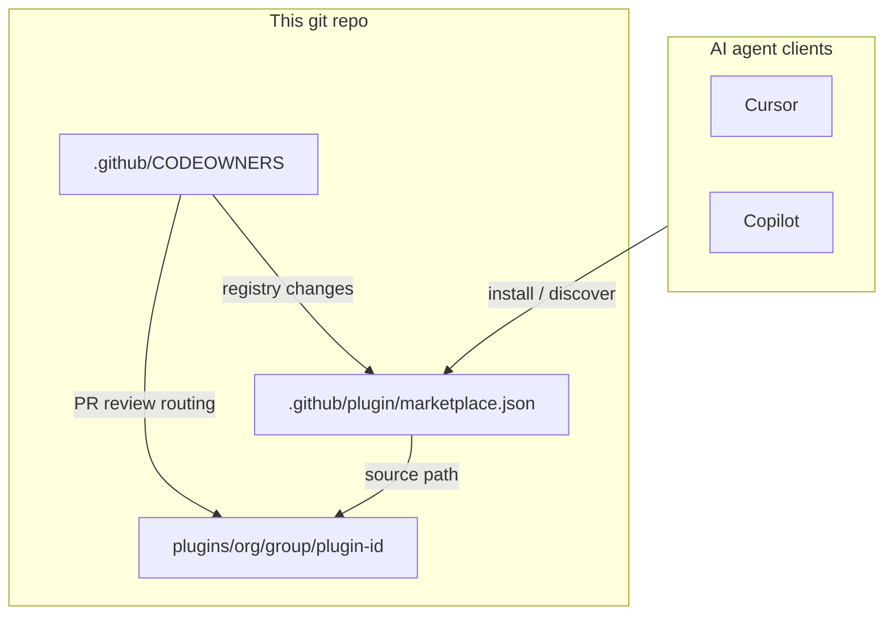
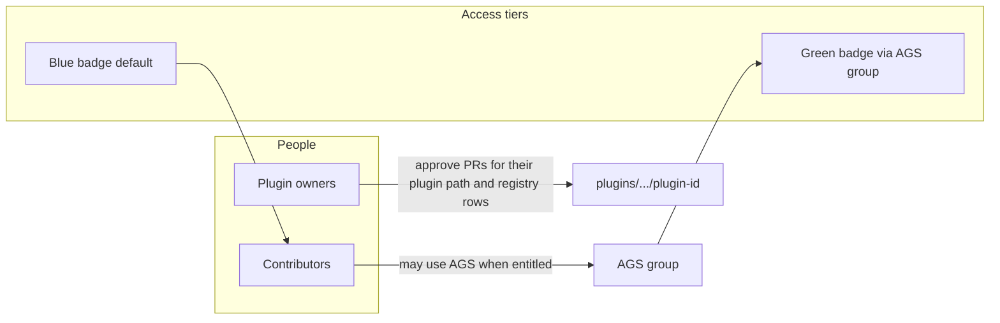

# Agent Plugin Marketplace — architecture and governance

This document visualizes how the repository is organized, how clients consume it, and how access and approvals are intended to work.

**HTML slide deck** (open the file in a browser): [`docs/agent-plugin-marketplace-slides.html`](../docs/agent-plugin-marketplace-slides.html).

## What this repository is

This repository is a **curated marketplace of agent plugins** for AI coding clients (for example Cursor, VS Code Copilot). Each **plugin** is a self-contained bundle that can include:

- **Agent definitions** (for example `agents/*.md`)
- **Skills** (reusable instructions and scripts under `skills/`)
- **MCP configuration** (for example `.mcp.json`, and optional `server.json` for published MCP metadata)

Plugins are **namespaced by organization and team** (`plugins/<org>/<group>/<plugin-id>`) so many groups can contribute without a single flat ownership model.

## How the repo connects to clients and reviews



- **Canonical plugin list**: [`.github/plugin/marketplace.json`](plugin/marketplace.json) — names, versions, `source` paths, and per-plugin `owners`.
- **Pull request routing**: [`CODEOWNERS`](CODEOWNERS) — GitHub requests reviews from the listed owners when matching paths change (registry and global rules have their own entries).

## Directory structure

```text
applications.agents-marketplace.plugins/
├── plugins/
│   └── <org>/                    # e.g. dcg
│       └── <group>/             # e.g. pse
│           └── <plugin-id>/     # e.g. geni-plugin, vdc-plugin, trust-mcp-server
│               ├── plugin.json  # plugin manifest (name, skills, mcpServers, cursorMcpServers, …)
│               ├── .mcp.json    # MCP server wiring for VS Code
│               ├── .cursor-mcp.json  # MCP server wiring for Cursor
│               ├── server.json  # optional MCP registry-style metadata
│               ├── agents/      # optional
│               └── skills/      # optional
├── .github/
│   ├── CODEOWNERS               # path-based review owners
│   └── plugin/
│       └── marketplace.json     # marketplace registry for VS Code + per-plugin owners[]
└── .cursor/
    ├── plugin/
    │   └── marketplace.json     # marketplace registry for Cursor
    ├── update-marketplace.ps1   # Cursor update script
    ├── tasks.json               # Cursor task automation
    └── README.md                # Cursor configuration guide
```

**Client tooling**: 
- VS Code: [`.vscode/update-marketplace.ps1`](../.vscode/update-marketplace.ps1) 
- Cursor: [`.cursor/update-marketplace.ps1`](../.cursor/update-marketplace.ps1)

These scripts can pull the repo and run `installScript` for newly listed plugins. That is install convenience for clients, not a substitute for registry or ownership rules.

## Governance and access

The following describes the **intended operating model** for badges, Agent Gateway Service (AGS), and contributors. Badge tiers are not stored as fields in `plugin.json` or `marketplace.json`; they are enforced by the hosting and identity systems that sit outside this repo.

| Topic | Meaning |
| ----- | ------- |
| **Blue badge** | Default baseline access for the marketplace or hosting surface. |
| **Green badge** | Elevated access (for example production-style use). **Green badge support is granted through membership in the AGS group**, not automatically with blue badge access. |
| **Contributors** | People who contribute plugins or changes. **AGS remains available** to contributors when they are entitled (for example via the same AGS group or other approved paths), subject to org policy. |
| **Per-plugin owner** | Every plugin has designated **owners for approvals**: changes under that plugin’s directory, and accountability for its registry row. In this repo that is reflected in **`owners` in `marketplace.json`** and **matching rules in `CODEOWNERS`**. Changes to `marketplace.json` or `CODEOWNERS` themselves also require the marketplace-wide owners listed in `CODEOWNERS`. |



### Approval flow (conceptual)

1. A contributor opens a pull request under `plugins/<org>/<group>/<plugin-id>/`.
2. GitHub applies **CODEOWNERS** — the plugin’s owner(s) are requested for review.
3. If the pull request also touches `.github/plugin/marketplace.json` or `.github/CODEOWNERS`, **additional marketplace or repo owners** are required, as documented in the comments in `CODEOWNERS`.

### Adding a new plugin

Keep **`owners` in `marketplace.json`** aligned with **`CODEOWNERS`** paths for `plugins/<org>/<group>/<plugin-id>/`, and use the same owner list the team expects for approvals.
